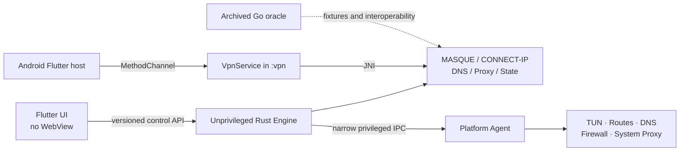

# Usque GUI implementation roadmap

This document turns the Windows and Android/Android TV first-public-beta product contract into release gates. macOS source is retained for later work but is not built, packaged, tested, or used as a `v0.1.0-beta.1` gate. A checked item means code exists and its current automated tests pass; it does not mean the public beta is ready.

## Architecture

Desktop UI and engine remain unprivileged. The desktop agent accepts only versioned, authenticated operations for TUN, routes, DNS, firewall state, and system proxy state. Android hosts the Rust `cdylib` inside the dedicated `:vpn` process.

## Milestone 1 — repository and contracts

- [x] Move the upstream Go CLI unchanged to `oracle/go`.
- [x] Create the Rust workspace and Flutter platform hosts.
- [x] Pin Rust and Flutter versions, Cargo/Flutter/Gradle dependency lockfiles,
  the Gradle distribution checksum, and Gradle artifact verification metadata.
- [x] Define `usque.v1` protobuf requests, responses, events, and structured errors.
- [x] Add bounded incremental protobuf framing and checked-in v1 wire snapshots.
- [x] Implement versioned profile defaults, validation, forward migration backup, and atomic JSON replacement.
- [x] Implement the fixed connection-state transition guard.
- [x] Add English/Chinese README, security policy, attribution, and reproducible brand-asset generation.
- [x] Freeze sanitized Go-oracle defaults, H2 request, and capsule fixtures and enforce them in Rust tests.
- [ ] Freeze independently reviewed, sanitized Go-oracle packet captures from the isolated laboratory.
- [x] Add protobuf backwards-compatibility snapshots, including identity provisioning.

## Milestone 2 — Rust network core

- [x] Encode/decode QUIC variable integers and CONNECT-IP datagram context IDs.
- [x] Implement Auto transport orchestration with H3-to-H2 fallback decisions.
- [x] Implement IPv4/IPv6 Happy Eyeballs scheduling with one winning path.
- [x] Model strict endpoint-pin requirements and structured failures.
- [x] Implement IP.SB dual-stack and geo-location probing interfaces.
- [x] Add log redaction for secret fields and values.
- [x] Implement Consumer WARP registration and manual Secret parsing with zeroized temporary buffers.
- [x] Port the Abobo7 P-256 Endpoint Pin semantics and authenticated one-shot refresh.
- [x] Implement bounded RFC 9484 ADDRESS_ASSIGN, ADDRESS_REQUEST, and ROUTE_ADVERTISEMENT codecs.
- [x] Implement the engine-side protobuf control service and serialized, atomic Profile CRUD.
- [x] Implement the pinned HTTP/3 + QUIC data path with `quiche`, CUBIC, pacing, and CONNECT-IP datagrams.
- [x] Interoperate with the live service through forced-H3 and Auto SOCKS5 TCP smoke tests without TUN.
- [ ] Harden H3 flow control, cancellation, reconnect, probe, and hostile-network behavior for release.
- [x] Implement the pinned production HTTP/2 + TCP + TLS tunnel with `h2` and BoringSSL.
- [x] Apply peer address/route replacements as fail-closed full-tunnel policy,
  degrade withdrawn families, and generate/process required ICMP errors.
- [x] Implement tunnel DNS for the SOCKS5 TCP data path.
- [x] Apply default or user-configured VPN DNS on Windows and Android, filter
  single-family plans, and reject system/LAN/CIDR/endpoint DNS leak paths.
- [x] Implement SOCKS5 TCP.
- [x] Implement SOCKS5 UDP ASSOCIATE with tunnel-only forwarding, source binding, and idle cleanup.
- [x] Interoperate SOCKS5 TCP and UDP over forced H3 and forced H2 live paths without TUN.
- [x] Implement HTTP CONNECT and ordinary Forward with bounded parsing and strict body framing.
- [x] Interoperate HTTP CONNECT and Forward over forced H3 and forced H2 live paths without TUN.
- [ ] Gate `smoltcp` against the Go oracle performance and compatibility thresholds.
- [x] Add jittered ten-minute H3 recovery probes after an H2 fallback and atomically retain only one active channel.

## Milestone 3 — platform slices

### Windows

- [x] Current-user SID-scoped Named Pipe ACL and bounded protobuf server.
- [x] Connect the Flutter Windows host to the Named Pipe client, sidecar lifecycle, Profile sync, and Active Profile selection.
- [x] Stream snapshots and capability events over an independent user-scoped Named Pipe into Flutter `EventChannel`; remove Windows UI polling.
- [x] Narrow Windows service/agent IPC with SID, executable-path, and Authenticode signer checks.
- [x] Implement Wintun session ownership, shared-memory packet rings, endpoint bypass, dual-stack route/DNS plans, and a write-ahead cleanup journal.
- [x] Implement a persistent Windows Filtering Platform Kill Switch and fail-closed Agent/Engine reattachment after either process restarts.
- [x] Credential Manager vault backend for all identity record types.
- [x] Keep saved identity write-only in the first beta; no reveal/copy/export API is exposed.
- [x] Implement transactional system-proxy snapshot, apply, and crash/uninstall recovery.
- [x] Add WiX 5 MSI authoring, exact Wintun/signature validation, Agent service installation, and fatal uninstall/upgrade recovery sequencing.
- [ ] ARM64, x86-64-v2, and x86-64-v1 MSI packaging.

### Android and Android TV

- [x] API 26 minimum, TV Leanback entry, and non-touchscreen compatibility.
- [x] Dedicated `:vpn` process, `VpnService`, foreground notification, control Binder, and JNI boundary.
- [x] Fail closed before creating the VPN if the Rust data channel is unavailable.
- [x] Wire arm64-v8a, armeabi-v7a, and x86_64 Rust targets into Gradle `jniLibs`.
- [x] Transfer connection snapshots from `:vpn` to the UI over a bounded-time Binder request.
- [x] Validate manually entered WARP Secrets in Rust before encrypting them with Android Keystore.
- [x] Stream native events/counters from `:vpn` through Binder callbacks and Flutter `EventChannel`.
- [x] Automatic Consumer registration through Rust before Android Keystore persistence.
- [x] Keep saved identity write-only in the first beta; no reveal/copy/export API is exposed.
- [x] Implement `VpnService.Builder` address/DNS setup, API 26–32 CIDR complements, API 33+ exclusions, a 256-route ceiling, retained TUN reconnects, `protect(fd)`, and underlying-network rebinding.
- [ ] Sleep, network-switch, captive-portal, and TV lifecycle tests.

### macOS (deferred; not a first-beta gate)

- [x] Current-user Unix Socket permissions, peer-UID validation, and protobuf engine IPC.
- [x] Connect the Flutter macOS host to the Unix Socket client and sidecar lifecycle.
- [ ] Minimal launch daemon/helper and authorization flow.
- [ ] utun, route, resolver, PF Kill Switch, and recovery journal.
- [x] Keychain storage for all identity record types.
- [ ] LocalAuthentication re-authentication for reveal/copy/export operations.
- [ ] System proxy snapshot, apply, and crash/uninstall recovery.
- [ ] macOS 12+ Universal and macOS 10.15–11.7 Intel-compatible PKG packaging.

## Milestone 4 — Flutter UX

- [x] Responsive Home, Profiles, Proxy, Settings, Advanced, and Diagnostics/About pages.
- [x] Four-step permissions, terms, and Consumer WARP identity onboarding.
- [x] White/orange visual system, dark mode, and Lucide-only interface icons.
- [x] Exact default endpoints, SNI, MTU, DNS, listener addresses, and reset action.
- [x] VPN/SOCKS5/HTTP mutual exclusion and non-loopback listener warning.
- [x] Remote/configured/system Proxy DNS selection with an explicit local-DNS leak warning.
- [x] Exit location, IPv4, IPv6, protocol, family, duration, and traffic UI.
- [x] English and Simplified Chinese string catalogs.
- [x] Adaptive desktop/mobile navigation and focusable Material controls.
- [x] Retain a bounded, corruption-safe one-time reader for the legacy Flutter Profile draft.
- [x] Make versioned Rust configuration the authoritative Profile store on Windows and Android, then remove the migrated Flutter draft.
- [x] Connect desktop and Android identity provisioning to their platform vaults.
- [x] Do not expose reveal/copy/export in the first beta.
- [x] Fetch fixed-version `flag-icons` SVG through the active tunnel, validate it, cache it, and return SVG bytes to Flutter.
- [x] Add the captive-portal confirmation/countdown UI and Android pause/resume behavior with Lockdown and network-change safeguards.
- [x] Add diagnostics content review plus Windows and Android native save pickers; exported bundles contain bounded sanitized summaries and logs.
- [x] Add manual and rate-limited automatic GitHub prerelease checks without automatic installation.
- [x] Add privacy-filtered 7-day/20-MiB JSON log rotation on Windows and Android.
- [x] Add widget tests for Simplified Chinese dark mode at 200% scaling and Android TV D-pad navigation.
- [ ] Add deterministic pixel-golden coverage for every declared theme, locale, and viewport matrix.

## Milestone 5 — release hardening

- [ ] Real-device H3/H2 interoperability and hostile-network matrix.
- [ ] IPv4, IPv6, DNS, route, reconnect, crash, sleep/wake, and uninstall leak tests.
- [ ] Throughput >= 90% of Go oracle, p95 latency regression <= 10%, memory <= 125%.
- [ ] Stable signing identities and published fingerprints.
- [ ] All declared packages built from one protected SemVer tag.
- [ ] SHA-256, SPDX/CycloneDX SBOM, provenance, commit, certificate fingerprint, and license inventory.
- [ ] Clean-machine installation and removal validation for every artifact.

The release workflow must remain disabled or fail closed while any Windows or Android artifact, signing input, architecture, or mandatory test is missing. A locally built binary cannot replace a failed GitHub Actions artifact.

The protected workflow and hardware-lab handoff are specified in
[RELEASE.md](RELEASE.md) and [LAB_EVIDENCE.md](LAB_EVIDENCE.md). `release/READY`
is generated by CI only after both evidence sets validate against the hashes of
the seven signed artifacts; it is never a pre-committed approval switch.
