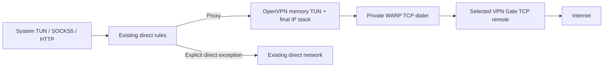

# WARP → VPN Gate

VPN Gate is an optional final exit for Windows, Android and Android TV. Open
**Proxy → VPN Gate**, refresh the directory, filter by country, select a TCP
server, and explicitly save or apply the selection. The switch is off for old
and new configurations. Selecting a row edits a draft; it does not reconnect.

The current connected server and the draft are separate. An enabled selection
is device-wide and shared across WARP accounts. A failed apply retains the
requested target and its error. A node disappearing from the directory does
not change its saved configuration or disconnect an existing session.

## Packet path

OpenVPN is an additional exit setting. WARP CONNECT-IP/L4 and HTTP/3/HTTP/2
remain independent choices. The selected OpenVPN TCP connection always uses
the WARP internal dialer, without Geo matching. There is no second OS VPN
interface, OpenVPN process, physical OpenVPN socket or public bootstrap proxy.
Business UDP uses IP packets inside OpenVPN TCP; HTTP retains its existing
HTTP/CONNECT semantics. TCP encapsulation can increase latency under loss.

The final IP addresses, DNS and MTU come from OpenVPN. WARP assignments stay
inside the underlay. Unsupported proxy address families are refused in the
final stack and TUN path. Explicit Geo, CIDR, LAN, system-proxy bypass and
Android application exceptions retain their direct behavior. User-configured
local/direct DNS is preserved; remote DNS and exit diagnostics use the final
session and never substitute the node's advertised IP for a measured exit.
In remote DNS mode, the OS uses the existing internal DNS listener and its host
route. This keeps a VPN-pushed private resolver inside the final channel even
when LAN bypass is enabled; Geo direct DNS exceptions still follow their rules.

Traffic samples count packets entering and leaving the final VPN Gate channel.
RTT, loss, congestion and HTTP/QUIC diagnostics describe the underlying WARP
connection to Cloudflare; they do not measure the complete path through the
volunteer server. The network quality page labels this scope. Replacing either
the VPN Gate session or the active WARP transport starts a new sample history,
so counters from different sessions cannot form a traffic-rate interval.
WARP connection events remain available while VPN Gate is active.

A connected VPN Gate node providing only IPv4 shows connected when IPv4 is
available; unsupported proxied IPv6 stays blocked. Losing IPv6 from a dual-stack
assignment still shows limited connectivity, as does reduced family support
without VPN Gate.
Exit location and public addresses still depend on a successful final-channel
probe and may be unavailable during network fluctuations.

## Directory and saved configuration

The mirror's [schema contract](https://github.com/GeorgeXie2333/vpngate-list-mirror/blob/main/docs/protocol.md)
is validated in `usque-core::vpngate`. The client requests the exact Raw
`refs/heads/main/data/servers.json` first. Only after failure does it race the
five complete, validated CDN responses at `cdn`, `fastly`, `gcore`, `testingcf`
and `quantil.jsdelivr.net`, using the mirror's `@latest/data/servers.json` path.
A fast invalid response cannot win. Remaining requests are dropped after a
validated winner. If all fail, the same sequence runs once through WARP.

Connected refreshes use the final session first and reuse its WARP underlay
for fallback. Offline fallback creates an account-bound headless WARP session
and releases it after completion or cancellation. It creates no user listener,
TUN or system proxy. Refresh operations coalesce, cancel on account/lifecycle
changes and expose bounded stage errors. Each request has a 5-second connect
deadline and a 15-second response deadline. Redirects and system proxies are
disabled. Identity encoding is requested; other encodings are rejected, so
decompression cannot bypass the 16 MiB entity limit.

Schema version, count, stable IDs, field types, canonical Base64, configuration
size and SHA-256 are checked before atomic cache replacement. Limits are 5,000
records and 128 KiB per OpenVPN configuration. Country counts and pages derive
from that same snapshot. The source score controls ordering; source Ping and
speed are not measurements from this device. Cached data appears immediately;
the foreground page refreshes after an hour and supports manual refresh.
Acquisition time is not an upstream update timestamp. CDN cache freshness is
not guaranteed to match the mirror's hourly schedule.

A saved selection pins both node ID and configuration SHA-256, with its own
configuration snapshot. IPC and Kotlin expose bounded metadata pages, not
configuration bodies. Applying a stale draft requires reselection. Refresh
does not rewrite the pinned snapshot.

## Native boundary and verification

`usque-openvpn` embeds OpenVPN 3 Core 3.11.7 at
`18edfae7e7fd8051c93bd4746ec69be91eb02dbb`, C++17 and Mbed TLS 3.6.7. Its C ABI
exchanges bounded packets and typed events with a dedicated core thread.
Transport generation checks reject old callbacks. Native input and output are
each limited to 256 entries / 4 MiB; Rust IP channels have independent byte
budgets. TCP lengths are two-byte network-order frames, read/written with
partial-I/O handling. Cancellation stops producers and joins the core.

The profile allowlist permits only numeric TCP remotes matching the directory
IP and preserves the advertised port. UDP profiles are not rewritten. Scripts,
plugins, external file references, nested proxies, compression and peer
verification bypasses are rejected. The minimum TLS version is 1.2. CBC/SHA1
refers to the data channel; it does not disable TLS certificate verification.
The native TUN builder captures assignments and never executes pushed OS routes.

Mbed TLS authenticates the OpenVPN CA chain and configured OpenVPN certificate
constraints, rather than assuming an HTTPS DNS SAN for a numeric VPN remote.
Compatibility patches explicitly select CBC PKCS#7 padding and enforce TLS
version limits. The complete patch rationale is in
[the upstream patch record](../third_party/openvpn3-3.11.7/USQUE-PATCH.md).

## Lifecycle, cleanup and privacy

Final traffic is admitted only after negotiation and platform attachment.
Switching closes old final flows, retains a usable WARP session, builds a new
OpenVPN session and applies its final assignment. No failure path intentionally
selects WARP or physical egress as the final fallback. The retry controller
uses the same saved node and existing bounded backoff; certificate,
authentication and configuration errors are terminal.

Windows Agent owns the sole Wintun, route, DNS and WFP journal. Chain protection
is installed before final negotiation, including when the persistent Kill
Switch setting is off. Finalization changes only address/DNS/MTU fields; it
cannot change bootstrap endpoints or direct exceptions. The transition guard
is retained through final setup failure and ordinary node switches, and is
restored through the disconnect journal. Persistent protection remains governed
by the existing Kill Switch setting and Agent recovery rules.

Android uses its existing VpnService and a blocking interface during setup.
A new final interface is established and attached before retiring the old Java
descriptor. A rejected handoff closes final admission and keeps the blocking
interface. Only WARP outer sockets and explicit direct traffic receive physical
socket protection. Always-on/Lockdown and process-death guarantees retain their
existing Android boundaries. In-process admission is not an independent OS
Kill Switch.

Directory hosts learn directory requests; the WARP provider carries the
OpenVPN connection; the selected volunteer provides final egress. Configurations
and public client key material stay in engine storage, not Flutter status,
free-form logs or diagnostics. Native logging and hardware identifiers are
suppressed. No new automatic telemetry or diagnostic upload is introduced.

## Sources, licenses and validation

OpenVPN Core uses MPL-2.0; Mbed TLS uses Apache-2.0; Asio uses BSL-1.0; LZ4
and xxHash use BSD-2-Clause. The selected sources and original license texts
are vendored. [The source lock](../tool/openvpn_sources.json) pins archives,
original file hashes and reviewed patch hashes. Run
`python tool/check_openvpn_sources.py`; it also verifies the license asset
available from the VPN Gate page. Release SPDX generation includes these native
packages, which Cargo/Gradle inventories alone do not discover.

Use the complete [change-scoped checks](../CONTRIBUTING.md). Native protocol
tests additionally run with `cargo test -p usque-openvpn --features interop-test
--locked` after initializing the supported Windows build environment. The
memory peer uses public test identities, TLS 1.2, CBC/SHA1, UDP-shaped IP packets,
rekeying and terminal authentication failures; it opens no OS sockets or TUN.
It is a Core-to-Core protocol test, not evidence of OpenVPN 2 server or public
volunteer availability. The feature is excluded from production builds.

The [local implementation validation record](VPN_GATE_VALIDATION.md) lists
completed commands, the blocked PowerShell check and isolated checks not run.

Real TUN, WFP, routes, leaks, crash recovery and Android device lifecycle must
be checked in the environments defined by [the safety contract](../AGENTS.md).
They are **not run on a development workstation**. The controlled exit matrix
must compare TUN/SOCKS5/HTTP traffic against the same selected VPN Gate session,
then independently exercise direct exceptions, unsupported IPv6, changed
assignments, WARP loss, Gate loss, node switching and explicit disconnect.
Missing isolated evidence is not a pass and is not a publication prerequisite.
